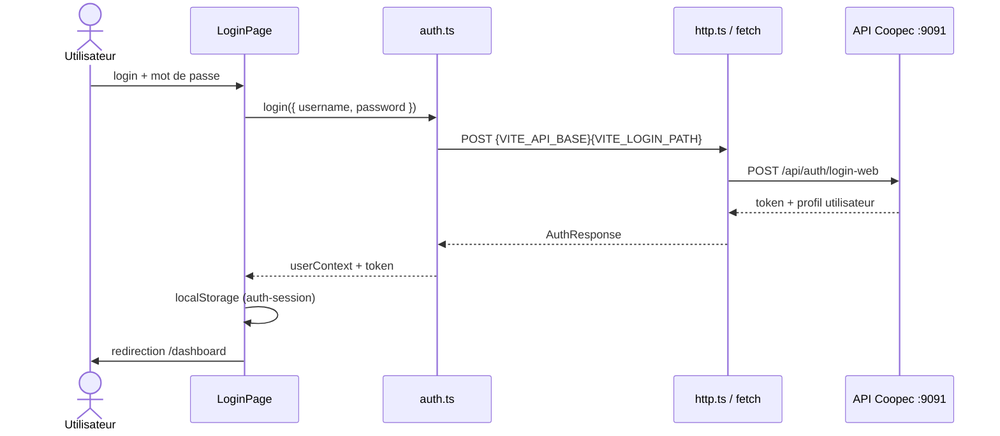
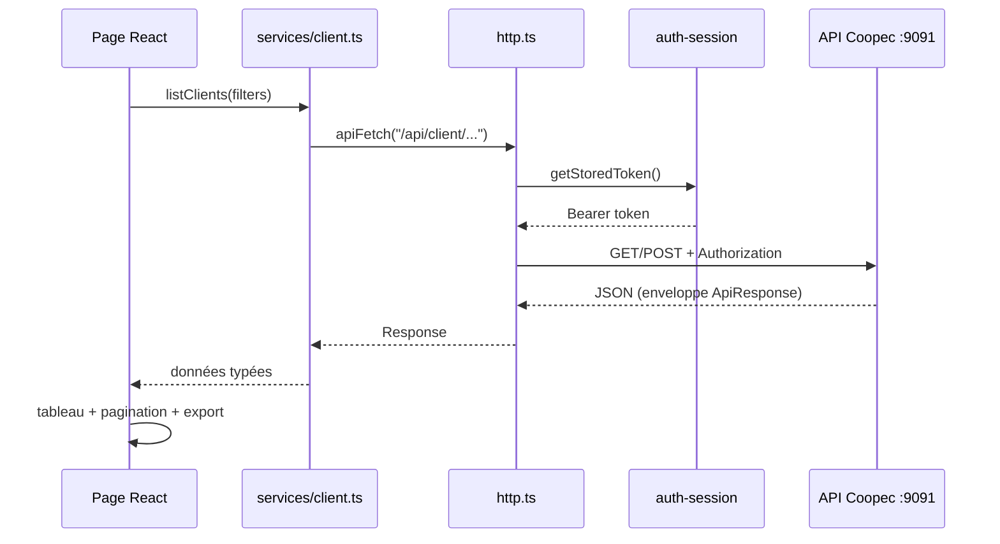
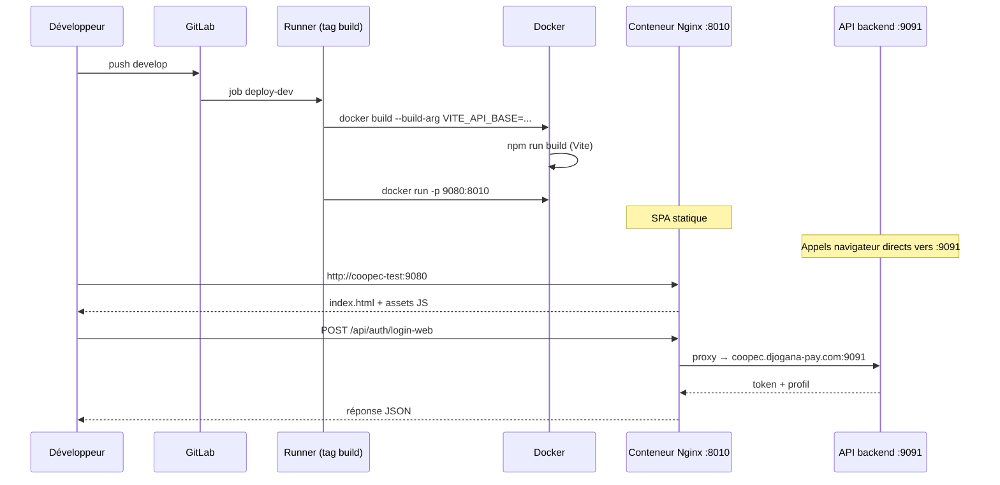

# Coopec Interface (Web v2)

Interface web de gestion **Coopec Collect** — tableau de bord, administration, opérations, états, prêts et extractions. Application **React + TypeScript + Vite**, conçue pour un usage **bureau** (desktop).

## Liens GitLab

| Ressource | URL |
|-----------|-----|
| **Dépôt** | https://gitlab.com/djogana-pay/coopec_web_v2 |
| **Branches** | https://gitlab.com/djogana-pay/coopec_web_v2/-/branches |
| **Pipelines CI/CD** | https://gitlab.com/djogana-pay/coopec_web_v2/-/pipelines |
| **Variables CI/CD** | https://gitlab.com/djogana-pay/coopec_web_v2/-/settings/ci_cd |
| **Merge requests** | https://gitlab.com/djogana-pay/coopec_web_v2/-/merge_requests |

## Ports et URLs

| Contexte | Port / URL | Description |
|----------|------------|-------------|
| **Interface web (Docker)** | Hôte **9080** → conteneur **8010** | Front React/Nginx — déploiement GitLab CI |
| **API Coopec (backend)** | https://coopeccollect.djogana-pay.com:**9091** | API Java — **ne pas réutiliser le port 9091 pour le front** |
| **Dev local (Vite)** | http://localhost:5173 | `npm run dev` — proxy `/api` via `VITE_API_PROXY_TARGET` |
| **Preview build local** | http://localhost:4173 | `npm run preview` après `npm run build` |

> Sur le serveur `peya-pay-test-2`, le port **9091** est occupé par l’API backend. L’interface web est exposée sur le port hôte **9080** (Nginx écoute **8010** dans le conteneur).

### Déploiement par branche

| Branche | Job GitLab | Runner tag | Port interface | Déclenchement |
|---------|------------|------------|----------------|---------------|
| `develop` | `deploy-dev` | `build` | **9080** (→ 8010) | Push sur `develop` |
| `production` | `deploy-production` | `production` | **9080** (→ 8010) | Push sur `production` |

Après déploiement, l’interface est accessible sur :

- **Développement** : `http://<serveur-runner-build>:9080`
- **Production** : `http://<serveur-runner-production>:9080`

Le port hôte est surchargeable via la variable CI `APP_HOST_PORT` (défaut : **9080**).

### Variables CI/CD recommandées (GitLab → Settings → CI/CD → Variables)

| Variable | Environnement | Exemple | Rôle |
|----------|---------------|---------|------|
| `API_UPSTREAM` | les deux | `http://host.docker.internal:9091` | Proxy Nginx → API sur l’**hôte** Docker |
| `API_UPSTREAM_HOST` | les deux | `coopec.djogana-pay.com` | En-tête `Host` attendu par l’API Java |
| `APP_HOST_PORT` | les deux | `9080` | Port hôte de l’interface (conteneur : 8010) |
| `VITE_LOGIN_PATH` | build | `/api/auth/login-web` | Endpoint de connexion (optionnel) |

## Prérequis

- **Node.js** 20+ (recommandé)
- **npm** 10+
- Accès à l’API Coopec (URL de base et identifiants)

## Installation

```bash
git clone https://gitlab.com/djogana-pay/coopec_web_v2.git
cd coopec_web_v2
git checkout develop
npm install
```

Créez un fichier `.env` à la racine (non versionné) et configurez-le selon votre environnement (voir ci-dessous).

## Démarrage

```bash
# Développement (Vite + proxy API optionnel)
npm run dev

# Build de production
npm run build

# Aperçu du build
npm run preview
```

## Configuration

Variables principales pour `.env` (fichier local, non versionné) :

| Variable | Description |
|----------|-------------|
| `VITE_API_BASE` | URL de base de l’API (vide = même origine / proxy) |
| `VITE_LOGIN_PATH` | Endpoint de connexion (défaut : `/api/auth/login-web`) |
| `VITE_API_PROXY_TARGET` | Cible du proxy Vite en local (ex. `https://coopeccollect.djogana-pay.com:9091`) |
| `VITE_DASHBOARD_STATS_PATH` | Statistiques du tableau de bord |

D’autres chemins optionnels (`VITE_PRET_*`, `VITE_ETAT_*`, etc.) peuvent être ajoutés dans `.env` selon les écrans utilisés.

### Comment l’API est branchée

| Couche | Fichier | Rôle |
|--------|---------|------|
| **Build** | `Dockerfile` | `VITE_API_BASE=""` → appels relatifs `/api/...` |
| **Runtime** | `docker/nginx/default.conf.template` | Nginx proxy `/api` → `API_UPSTREAM` |
| **HTTP** | `src/services/http.ts` | `apiFetch()` — préfixe vide + chemin `/api/...` |
| **Auth** | `src/services/auth.ts` | Login via `/api/auth/...` (même origine) |
| **Services** | `src/services/*.ts` | Un module par domaine (user, client, prêt, état…) |
| **Dev proxy** | `vite.config.ts` | Redirige `/api` → `VITE_API_PROXY_TARGET` si défini |
| **Vercel** | `api/proxy.ts` | Proxy serverless (optionnel) |

En **Docker**, le navigateur appelle `https://<front>:9080/api/...` ; Nginx relaie vers l’API sur l’hôte (`host.docker.internal:9091` par défaut).

> **504 Gateway Timeout** : le conteneur n’atteint pas l’API. Par défaut on utilise `http://host.docker.internal:9091` (API sur le même serveur que Docker). Si l’API est sur une autre machine, définir `API_UPSTREAM` dans GitLab (ex. `https://coopec.djogana-pay.com:9091`) et ouvrir le firewall sortant port 9091.

## Architecture — diagrammes de séquence

### Connexion utilisateur



### Appel métier (ex. liste clients)



### Déploiement GitLab CI



## Structure du projet

```
coopec-interface/
├── .gitlab-ci.yml          # Pipeline deploy-dev / deploy-production
├── Dockerfile              # Build Vite + image Nginx
├── docker/nginx/           # Template Nginx + entrypoint (proxy /api)
├── vite.config.ts          # Alias @, proxy /api en dev
├── api/proxy.ts            # Proxy Vercel (optionnel)
├── docs/                   # État des lieux (Word)
├── scripts/                # Utilitaires (génération doc)
├── public/                 # Favicon, icônes statiques
└── src/
    ├── main.tsx            # Point d’entrée React
    ├── App.tsx             # Routes React Router
    ├── index.css           # Styles globaux (Tailwind)
    │
    ├── components/         # UI réutilisable
    │   ├── ui/             # shadcn (button, sheet, select…)
    │   ├── animate-ui/     # Composants animés (accordion, hover-card)
    │   ├── DashboardSidebar.tsx
    │   ├── DirectionAgenceFilterSheet.tsx   # Tiroir filtre Direction/Agence
    │   ├── RequireAuth.tsx
    │   ├── CourbeCollectChart*.tsx
    │   └── Table*.tsx      # Pagination, export, tri colonnes
    │
    ├── contexts/
    │   ├── DashboardFiltersContext.tsx      # Filtres institution/direction/agence
    │   └── DashboardSectionNavContext.tsx   # Navigation sections drawer
    │
    ├── hooks/
    │   ├── use-direction-agence-filters.ts
    │   ├── use-table-pagination.ts
    │   └── use-inactivity-logout.ts
    │
    ├── layouts/
    │   ├── DashboardAppLayout.tsx           # Shell authentifié (sidebar)
    │   ├── DashboardSectionsShell.tsx       # Sections avec sous-menu drawer
    │   ├── DashboardTablePageLayout.tsx     # Layout pages tableaux
    │   └── DashboardPageShell.tsx
    │
    ├── constants/
    │   ├── dashboard-sections.ts            # Menu sidebar + routes sections
    │   └── table-styles.ts
    │
    ├── pages/              # Écrans métier (1 dossier ≈ 1 domaine)
    │   ├── LoginPage/
    │   ├── DashboardPage/
    │   ├── UsersPage/          # + components/, hooks, mappers
    │   ├── CollecteursPage/
    │   ├── ClientsPage/
    │   ├── AbonnementsPage/
    │   ├── AgencesPage/
    │   ├── CoopecInstitutionsPage/
    │   ├── ObjectifsPage/
    │   ├── TypePretPage/
    │   ├── OperationsPage/     # Arrêtés, reversements cartes…
    │   ├── EtatsPage/          # États opérationnels / comptables
    │   ├── PretsPage/          # Workflow, déblocage, impayés…
    │   ├── ExtractionTxtPage/
    │   ├── ExtractionCartePage/
    │   ├── HistoriqueComptablePage/
    │   ├── CourbeCollectPage/
    │   ├── CartesClientelePage/
    │   └── AidePage/
    │
    ├── services/           # Couche API (appels HTTP)
    │   ├── http.ts             # apiFetch — cœur HTTP + token
    │   ├── auth.ts             # Login, reset password
    │   ├── session.ts          # Logout
    │   ├── api-json.ts         # Helpers JSON / enveloppes
    │   ├── openapi.ts          # Types générés / référence OpenAPI
    │   ├── administration.ts   # Objectifs, types prêt, params…
    │   ├── user.ts, client.ts, collecteur.ts, agence.ts
    │   ├── operation.ts, abonnement.ts
    │   ├── dashboard*.ts, courbe-collect.ts
    │   ├── etat-*.ts, pret-*.ts, charge-epargne.ts…
    │   └── extraction-*.ts, historique-comptable.ts
    │
    ├── utils/              # Mappers, labels, exports
    │   ├── auth-session.ts       # Token localStorage
    │   ├── api-envelope.ts       # Parse réponses API
    │   ├── table-export.ts       # Excel / PDF
    │   ├── objectif-mappers.ts, type-pret-mappers.ts
    │   └── direction-label.ts, profile-label.ts…
    │
    ├── assets/             # Logos, bannières (images)
    └── lib/utils.ts        # cn() Tailwind
```

### Flux des couches (front)

```
pages/  →  services/  →  http.ts  →  API Coopec
   ↑           ↑
hooks/     utils/ (mappers, session)
contexts/
layouts/
```

### Routes principales (`App.tsx`)

| Chemin | Page |
|--------|------|
| `/`, `/login` | Connexion |
| `/dashboard` | Tableau de bord |
| `/dashboard/utilisateurs` | Gestion utilisateurs |
| `/dashboard/collecteurs`, `/clients`, `/abonnements` | Référentiels |
| `/dashboard/operations/*` | Arrêtés, reversements |
| `/dashboard/etats/*` | États opérationnels |
| `/dashboard/prets/*` | Prêts |
| `/dashboard/objectifs`, `/configuration-type-pret` | Administration |
| `/dashboard/courbe-collect` | Courbe de collecte |
| `/dashboard/aide/*` | Aide intégrée |
| `/dashboard/agences`, `/coopec` | Agences, institutions |
| `/dashboard/extraction-txt`, `/extraction-txt-superviseur` | Extractions TXT |
| `/dashboard/extraction-carte`, `/historique` | Extraction carte, historique comptable |
| `/dashboard/cartes-clientele` | Cartes clientèle |

## Fonctionnalités principales

### Tableau de bord
- Tuiles statistiques (collecteurs, montants, opérations, épargne, cartes…)
- Filtres institution / direction / agence / collecteur

### Gestion
- **Utilisateurs** — CRUD, changement d’agence, renvoi paramètres, consultation workflow
- **Collecteurs** et **clients** — listes, filtres, exports Excel/PDF
- **Abonnements** — consultation, détail, reversement

### Administration
- Institutions Coopec et agences
- **Objectifs** — recherche, création, modification, suppression (API administration)
- **Configuration type prêt** — liste, enregistrement, modification, pièces jointes
- Extraction TXT superviseur, cartes clientèle (partiel)

### Opérations
- Arrêtés / annulations, validations des arrêtés
- Reversements cartes, états des cartes reversées

### États
- Montants collectés, annulations, collectes non comptabilisées
- Journal répartitions, charge épargne, validation mensuelle
- Comparatif, consolidé, collecte prêts, paiement en ligne

### Prêts
- Workflow, envoi demande client, déblocage
- États détaillés, suivi clientèle, compensation, impayés

### Autres
- Courbe de collecte, historique comptable, extractions TXT/carte
- Pages d’aide (documentation intégrée)

## Filtres et exports

- **Filtre Direction / Agence** : tiroir latéral « Filtre » (`DirectionAgenceFilterSheet`) sur les écrans concernés
- **Exports tableaux** : Excel et PDF via `src/utils/table-export.ts`

## Déploiement Docker (GitLab CI)

Le fichier `.gitlab-ci.yml` construit l’image et lance le conteneur :

```bash
docker build -t coopec_web_v2:<commit> .
docker run --restart always -d -p 9080:8010 \
  --add-host=host.docker.internal:host-gateway \
  -e API_UPSTREAM="http://host.docker.internal:9091" \
  -e API_UPSTREAM_HOST="coopec.djogana-pay.com" \
  --name coopec_web_v2 coopec_web_v2:<commit>
```

- **Dockerfile** : build Vite + Nginx (écoute **8010** dans le conteneur)
- **Mapping** : `-p 9080:8010` (hôte **9080** → conteneur **8010**)
- **API** : proxy Nginx `/api` → `API_UPSTREAM` (défaut `http://host.docker.internal:9091`)
- **Nom du conteneur** : `$CI_PROJECT_NAME` (= `coopec_web_v2`)

Build manuel local :

```bash
docker build -t coopec-interface .
docker run --rm -p 9080:8010 \
  --add-host=host.docker.internal:host-gateway \
  -e API_UPSTREAM="http://host.docker.internal:9091" \
  coopec-interface
# → http://localhost:9080  (API via /api/...)
```

## Branches

| Branche | Usage | Déploiement |
|---------|--------|-------------|
| `develop` | Intégration — push sur GitLab | Job `deploy-dev` (runner `build`) |
| `production` | Production | Job `deploy-production` (runner `production`) |
| `main` | Historique / miroir GitHub (si applicable) | — |

## État d’avancement

Un document détaillé **opérationnel / partiel / non prêt** est disponible dans :

`docs/Coopec-Interface-Etat-des-lieux.docx`

Pour le régénérer :

```bash
pip install python-docx
python scripts/generate-status-docx.py
```

## Sécurité

- Ne commitez **jamais** le fichier `.env` (identifiants, URLs internes).
- L’authentification repose sur la session API Coopec (`login-web`).

## Licence

Projet privé — **Djogana Pay** / Coopec. Usage interne sauf accord contraire.
